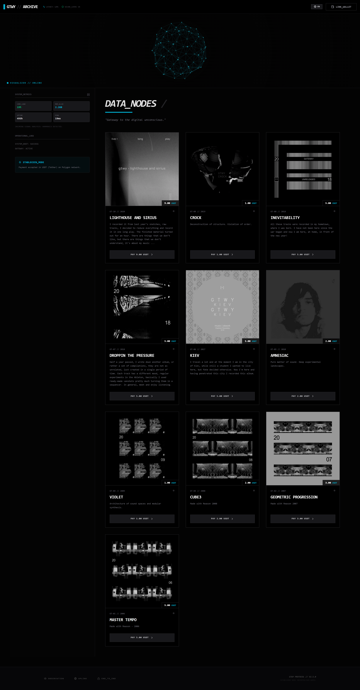
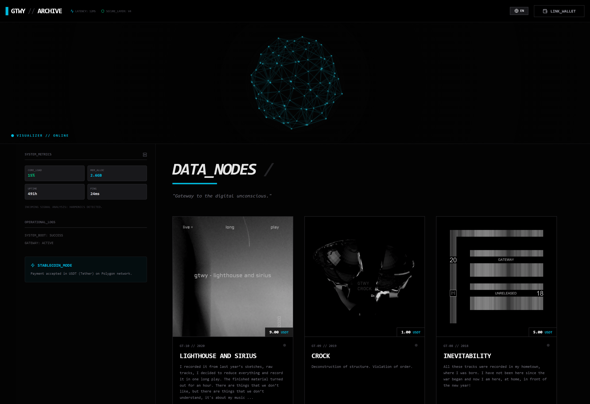

# GTWY // ARCHIVE

> Decentralised audio archive. Gateway to the digital unconscious.

A web interface for browsing, previewing, and purchasing albums from the GTWY music archive — built with React and Vite, with audio streamed directly from Bandcamp.

---

## Features

- **3D Visualizer** — Audio-reactive particle sphere rendered on Canvas
- **Audio Player** — Full playlist support, streamed from Bandcamp via proxy
- **EN / RU Localisation** — Toggle between English and Russian
- **Crypto Payment UI** — USDT payment flow (Polygon network)
- **Responsive Design** — Mobile-first layout with collapsible menu
- **System Dashboard** — Live metrics panel and operational logs

## Screenshots

### Full Interface


### Main Content


## Tech Stack

| Layer | Tech |
|-------|------|
| Framework | React 19 + Vite 7 |
| Styles | Tailwind CSS v4 |
| Icons | lucide-react |
| Audio | Web Audio API |
| Audio source | Bandcamp (proxied) |
| Visualizer | Canvas 2D |

## Getting Started

```bash
npm install
npm run dev
```

Open [http://localhost:5173](http://localhost:5173) in your browser.

## Project Structure

```
src/
├── App.jsx              # Root component & audio logic
├── components/
│   ├── Header.jsx       # Navigation, wallet, language toggle
│   ├── Sidebar.jsx      # System metrics & logs
│   ├── Visualizer.jsx   # 3D audio-reactive visualizer
│   ├── AlbumCard.jsx    # Album card with player & purchase
│   ├── AudioPlayer.jsx  # Fixed bottom audio player bar
│   └── Footer.jsx       # Footer
└── data/
    ├── albums.js        # Album catalogue (GT-01 – GT-10)
    └── dictionary.js    # EN/RU translations
```

## Albums

| ID | Title | Year | Price |
|----|-------|------|-------|
| GT-10 | lighthouse and sirius | 2020 | $9.00 |
| GT-09 | CROCK | 2019 | $1.00 |
| GT-08 | Inevitability | 2018 | $5.00 |
| GT-07 | Droppin The Pressure | 2018 | $5.00 |
| GT-06 | KIEV | 2017 | $5.00 |
| GT-05 | Amnesiac | 2010 | $2.00 |
| GT-04 | Violet | 2009 | $1.00 |
| GT-03 | CUBE3 | 2008 | $2.00 |
| GT-02 | geometric progression | 2007 | $3.00 |
| GT-01 | Master Tempo | 2006 | $5.00 |

## Roadmap

- [ ] Real Web3 wallet connection (MetaMask / WalletConnect)
- [ ] On-chain USDT payment on Polygon
- [ ] Post-purchase download link generation
- [ ] Production audio proxy / CDN

## License

© GTWY. All rights reserved.

